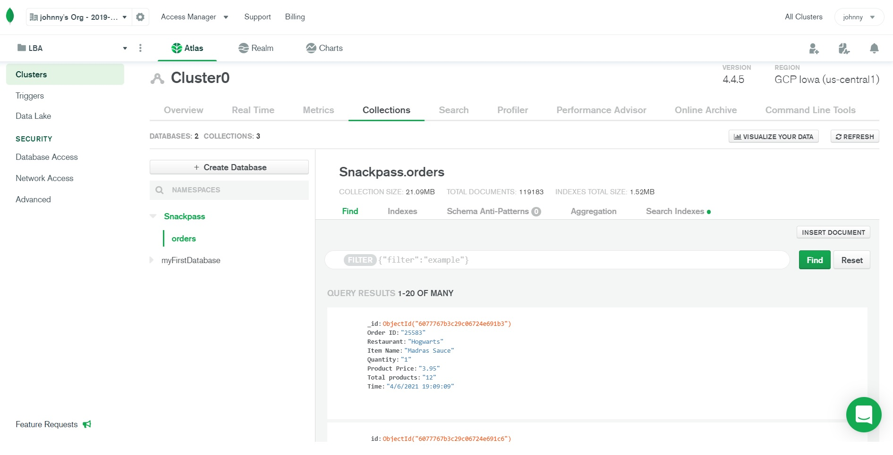

## About The Project

Assume the customers around a campus order 5000 orders a day from 50 local restaurants. Each order contains one or multiple products. For eg, `2 burritos, a soda, and a side of chips`. To provide a better user experience for users to choose their meals, I designed a full stack application which returns an infinite-scrolling list of trending products to the user. The definition of trending product here is purchased at least once in last 48 hours. This full-Stack solution including web server, backend persistence and associated code.

### Data

The sample data I used is here [Sample Orders](https://docs.google.com/spreadsheets/d/1djJkH4IBVvqpRqLA-YkA36guOtpZw_3CIsPLpulbIJk/edit?usp=sharing).
 
## Solution

  
  
  

Frontend: React  
Backend: NodeJS, Express  
Database: MongoDB  

I imported the sample data into MongoDB and used NodeJS(Express, Mongoose) to query the data, and generated an RESTful API to display the data. Next, I developed a frontend using React (React-bootstrap) to fetch the data and create this full-stack application.

To run the app, for the backend server,  under the "backend" folder, run "npm start" and open http://localhost:5000/orders and see the API. For the frontend, under the root folder and run "npm install" and "npm start" and open http://localhost:3000/ to see the app.
